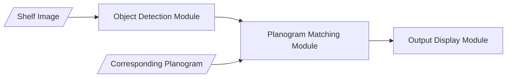

# Computer Vision-based planogram matching in retail businesses

This repository is a part of Master Degree Dissertation of School of Computing, Newcastle University, UK.

## Abstract
The retail industry hinges on the strategic utilisation of planograms to effectively present merchandise, captivate customers, and optimise sales. This study focuses on introducing a novel framework designed to analyse shelf images in conjunction with corresponding planograms, yielding precise outputs that identify missing products and their specific positions within the shelf layout. Comprising three key modules—an object detection module, a planogram matching module, and an output display module—this framework aims to furnish actionable insights for retailers seeking enhanced inventory management. The object detection module leverages the one-shot learning technique, employing YOLOv5 and YOLOv8 frameworks to construct object detection models. While both models exhibit promising training results, their testing performance falls short. The subsequent planogram matching module utilises the derived product locations to ascertain alignment with anticipated planograms. However, a limitation lies in assuming uniform image attributes. An integral aspect of this research is its practicality. The modular structure of the framework, encapsulated in python files, facilitates effortless deployment as web applications or executable files. In conclusion, this study underscores the pivotal role of planograms in retail operations and introduces a multi-faceted framework to address inventory management challenges. Although challenges persist in testing accuracy and data uniformity, this research contributes to the ongoing exploration of leveraging computer vision to enhance retail practices.

## Framework Overview

## Usage
- To run the framework, please take a look at demo notebook.
- To re train the model, please select between training-yolov5 notebook or training-yolov8 notebook.
